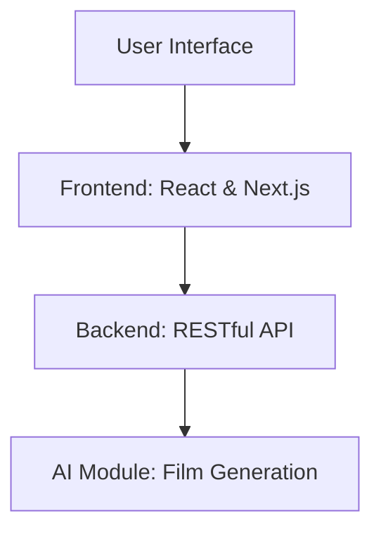

# AI Film Project

This project aims to generate films using artificial intelligence utilizing TypeScript, React, and Next.js. 

## Project Structure

1. **Frontend**: Developed using React and Next.js for efficient server-side rendering and dynamic webpage management.
2. **Backend**: Handles AI computations and film generation processes.
3. **AI Module**: Core component responsible for creating video content.

## Architecture Diagram

## Database Model

The database is designed to store user information, project settings, AI-generated content, and transactional logs. The core entities include:

1. **Users**: Store user credentials and profiles.
2. **Projects**: Application projects including settings and metadata.
3. **Content**: AI-generated films and related metadata.
4. **Logs**: Tracks system and error logs for debugging.

## Getting Started

To start on the project, clone the repository and follow the setup instructions...
